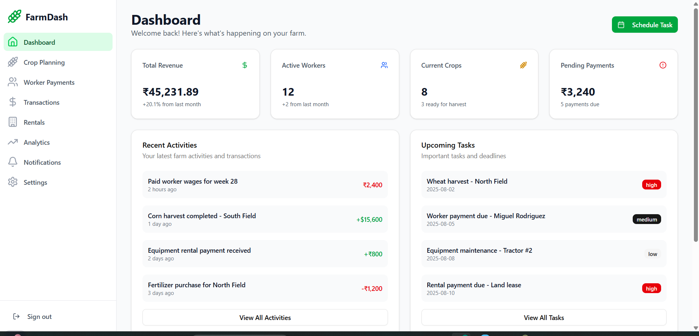
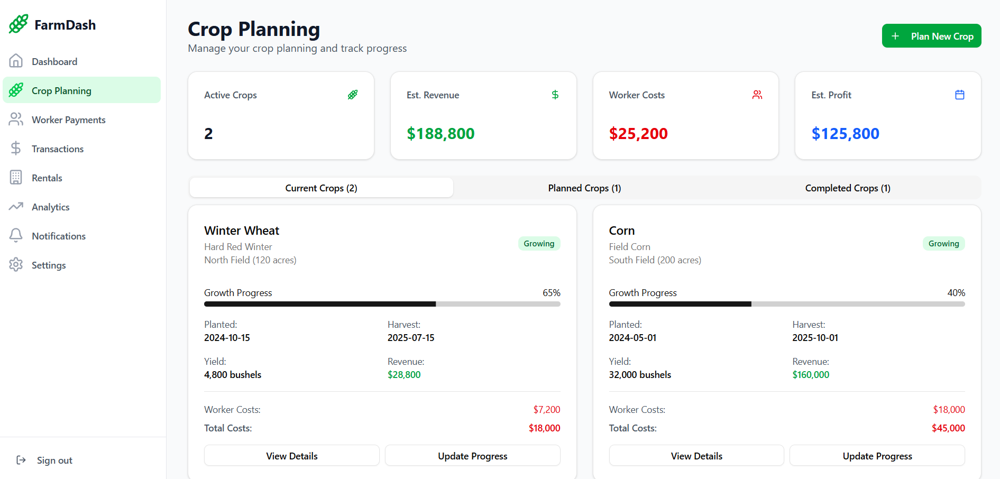
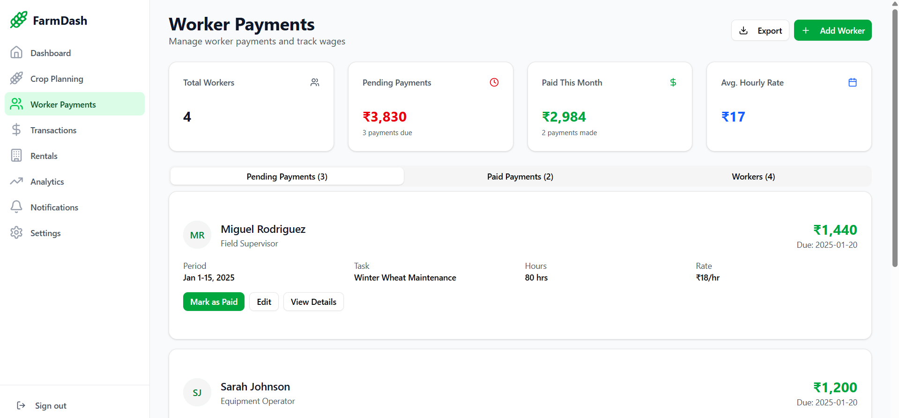
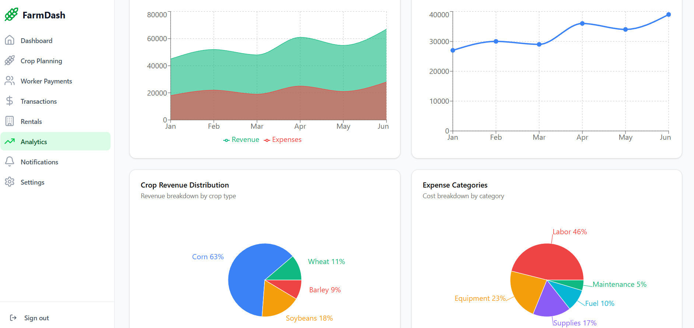

# 🌾 Farmer Dashboard – Smart Farm Management App

A modern, responsive, and interactive dashboard built using React.js for managing smart farm operations. It helps farmers track revenue, manage workers, plan crops, handle rentals, monitor transactions, and visualize data analytics — all in one place.

---

## 📊 Live Demo (Optional)

> 🚧 Add your deployed link here (e.g., Vercel/Netlify)  
> _Example:_ https://farmer-dashboard.vercel.app/

---

## 🚀 Features

- 🧭 **Navigation**: Sidebar with smooth routing between modules
- 📊 **Dashboard Cards**: Total Revenue, Active Workers, Current Crops, Pending Payments
- 📅 **Crop Planning**: Plan, track and complete crop cycles with visual progress bars
- 💸 **Worker Payments**: Track worker wages and payment statuses
- 📈 **Analytics**: Revenue vs Expenses, Category-wise breakdowns, KPI cards
- 🧾 **Transactions**: Income, expenses, filter, search, color-coded financials
- 🧑‍🌾 **Rentals**: Equipment/land rentals with income and payment tracking
- 📱 **Responsive UI**: Works across desktop, tablet, and mobile
- ⚡ **Performance**: Fast page load and smooth transitions
- 🔐 **Security**: React's XSS protection, sanitized input, HTTPS-ready

---

## 📸 Screenshots

### 🧭 Dashboard Overview


### 🌾 Crop Planning


### 💸 Worker Payments


### 📊 Analytics Dashboard


---

## 🧰 Tech Stack

- ⚛️ **React.js** (UI & state)
- 🔄 **React Router** (navigation)
- 📦 **Vite** (build tool)
- 📊 **Recharts** (charts & graphs)
- 💅 **Tailwind CSS / CSS Modules** (styling)
- 📁 **Modular Folder Structure**
- 📁 **Lucide Icons** for semantic UI icons

---

## 🛠️ Installation

### 📦 Clone and Run Locally

```bash
git clone https://github.com/sibirajansibi/Farmer-Dashboard---Smart-Farm-Management-App-.git
cd Farmer-Dashboard---Smart-Farm-Management-App-
npm install
npm run dev
